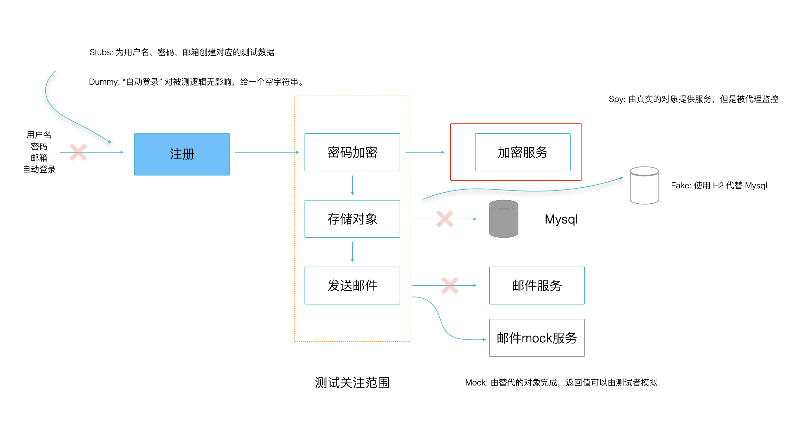

# 测试替身: Mock、Spy、Stub


## Test Double 简介

对于一个应用程序或者一个系统而言，很难给你一个纯粹的类进行单元测试。对象之间的依赖往往交织到一起，需要拆成各个单元才能逐个击破，也是单元测试的目的。

需要将这些交织到一起的对象拆开，需要一些工具，例如模拟一些数据、替换一些具有某些特定行为的类等。  网站 xunitpatterns.com 把这些工具称为 Test Double，翻译过来就是”测试替身“。

Martin Fowler 为了让这些概念更容易理解，在他的网站上重新更加具体的定义了它们：

- **Dummy** 被用来仅仅作为填充参数列表的对象，实际上不会用到它们，对测试结果也没有任何影响。
- **Fake** 一些假的对象或者组件，测试过程中会被用到。例如内存数据库 h2，假的用于用户鉴权的 Bean，一般只会在测试环境下起作用，不会应用于生产。
- **Stubs** 为被测试对象提供数据，没有任何行为，往往是测试对象依赖关系的上游。
- **Spies** 被依赖对象的代理，行为往往由被代理的真实对象提供，代理的目的是为了断言程序运行的正确性。
- **Mocks** 模拟一个具有特性行为的对象，在测试开始前根据期望提供需要的结果。被测试对象往往调用这个对象的方法时，根据条件得到不同的输入，从而满足测试对象的不同场景。例如，mock 数据库的存储层，返回正常数据、空或者丢出异常等情况。

实际开发中，根据测试框架的实现，对定义有一部分出入。但大体上不会差太多，框架往往会提供 Mock、Spy 相关实现，Stub、Fake、Dummy 则需要自己配置或者实现。

下面这张图简单说明了这些测试替身分别有什么用，项目中不必全部引入，根据需要使用即可。我拿用户注册这个例子作为说明，我们写的单元测试会聚焦于测试部分的代码，所以其他部分能模拟就想办法模拟。



下面我们使用 mockito 来测试依赖关系复杂的对象。

## mockito 介绍


mockito 的 logo 的是一杯莫尼托鸡尾酒，来源于 mock 的谐音。

mockito 是一个非常易用的 mock 框架。可以通过干净、流式的 API 编写出容易阅读的测试代码。mockito 和 Junit4 配合的非常完美，在 StackOverflow 投票中排名较高，另外也是 github 中引用占比非常高的一个框架。

mockito 最常用的方法是 mock、spy 两个方法，大部分工作都可以通过这两个静态方法完成。mock 方法输入一个需要模拟的类型，mockito 会帮你构造一个模拟对象，并提供一系列方法操控生成的 mock 对象，例如根据参数返回特定的值、丢出异常、验证这个 mock 对象中的方法是否被调用，以何种参数调用。

选择 mockito 的另外一个原因还在于它的生态和拓展性，在后面我们会逐步介绍一些静态方法、私有方法的模拟和测试。可以借用 powermock 来完成，powermock 和 mockito 能很好的协作。

## 使用 mock

在实例代码中的 stubs  模块中有一个 UserService 对象，用来演示用户注册的逻辑。在 register 方法中，注册的过程有密码 HASH、数据持久化、发送邮件三个主要流程，实际的注册方法必然更加复杂。这里做了大量简化，让我们关注于单元测试。

```java

public class UserService {
    private UserRepository userRepository;
    private EmailService emailService;
    private EncryptionService encryptionService;

    public UserService(UserRepository userRepository, EmailService emailService, EncryptionService encryptionService) {
        this.userRepository = userRepository;
        this.emailService = emailService;
        this.encryptionService = encryptionService;
    }

    public void register(User user) {
        user.setPassword(encryptionService.sha256(user.getPassword()));

        userRepository.savedUser(user);

        String emailSubject = "Register Notification";
        String emailContent = "Register Account successful! your username is " + user.getUsername();
        emailService.sendEmail(user.getEmail(), emailSubject, emailContent);
    }
}
```

为了演示 mockito 基本的使用方法，这里没有使用 Spring 框架，需要自己通过构造函数组织对象依赖关系。

我们的测试目标是 register 方法，和之前的示例不同，这里的被测试方法没有返回值，如果没有发生异常就代表功能和逻辑正常，因此无法根据返回值断言。另外，这个方法中会去调用其他对象，这在依赖关系如网状的现实对象依赖关系中不算什么。

UserService 的构造方法需要传入 userRepository、emailService、encryptionService 三个对象，否则无法工作。

我们来编写一个测试，并使用 mockito 创建我们需要的下游对象。

```java
public class UserServiceTest {

    @Test
    public void should_register() {
        // 使用 mockito 模拟三个对象
        UserRepository mockedUserRepository = mock(UserRepository.class);
        EmailService mockedEmailService = mock(EmailService.class);
        EncryptionService mockedEncryptionService = mock(EncryptionService.class);
        UserService userService = new UserService(mockedUserRepository, mockedEmailService, mockedEncryptionService);

        // given
        User user = new User("admin@test.com", "admin", "xxx");

        // when
        userService.register(user);

        // then
        verify(mockedEmailService).sendEmail(
                eq("admin@test.com"),
                eq("Register Notification"),
                eq("Register Account successful! your username is admin"));
    }
}
```

mock 对象帮我们创建了需要的模拟对象，而非真实的对象。通过 given/when/then 的方式组织测试代码，让测试看起来更为清晰。

对 register 对象来说，只需要知道验证传给 sendEmail 方法的参数是否按照我们预期即可，并不需要关心发送邮件内部，那是下一个单元测试需要关心的事情。

因此可以使用 verify 方法，传入模拟对象，并调用方法。verify 还可以传入验证的次数，如果是一个循环，被模拟的对象可能不止一次被调用，不传入的情况下默认是 1。 verify(mockedEmailService) 等价于  verify(mockedEmailService, 1)。

```java
verify(mockedEmailService).sendEmail(
                eq("admin@test.com"),
                eq("Register Notification"),
                eq("Register Account successful! your username is admin"));
```

另外这段代码中还需要验证发送邮件的参数是否是我们期望的。我们需要验证发送邮件的地址是 ”admin@test.com“，发送的内容中包含了用户名等信息。

这里使用了，eq 方法进行对比，需要注意的是 eq 方法和 assertThat 中的 equalTo 不太一样。这里是对参数进行验证，eq 方法来自于 ArgumentMatchers 对象，需要特别注意。

除了 eq 之外还有一些常用的验证器：

- notNull 非空校验
- same 引用校验
- isNull 空校验
- contains 包含
- matches 正则校验，比较常用
- startsWith、endsWith 字符串比较

## verify 传入下游的参数对象

上面我们验证了邮件发送的内容是否符合我们的预期，但是并没有验证传入 userRepository.saveUser 的内容是否按照我们的预期进行。

因此我们不仅需要验证 saveUser 方法的调用次数还需要验证传入的对象。在 java 中，如果修改了一个对象的属性值，我们只是比较一个对象的引用无法起到作用。所以在 verify 时，可以捕捉到传入的参数，再通过前面介绍的断言来完成验证。

```java
ArgumentCaptor<User> argument = ArgumentCaptor.forClass(User.class);
verify(mockedUserRepository).saveUser(argument.capture());

assertEquals("admin@test.com", argument.getValue().getEmail());
assertEquals("admin", argument.getValue().getUsername());
```

通过 ArgumentCaptor 构建一个 argument 对象，并捕捉参数，再用于断言即可。

## 修改 mock 对象的行为 

在 register 方法中，我们通过 encryptionService.sha256 来进行密码的 HASH。在单元测试中，我们可以 mock 了 encryptionService 方法。默认情况下调用被 mock 对象的方法会返回 null。

因此为了测试各种行为，我们需要让 mock 按照我们的意图返回数据。

```java 
given(mockedEncryptionService.sha256(any())).willReturn("cd2eb0837c9b4c962c22d2ff8b5441b7b45805887f051d39bf133b583baf6860");
```

通过 given ... willReturn 语句可以修改被 mock 的方法被调用时候的返回。除了 willReturn 方法之外，还可以做一些别的操作。

- willThrow 丢出一个异常
- willCallRealMethod 调用原始的方法
- will 传入一个 lambda 可以通过程序式的完成更多操作

另外值得一提的是给 sha256 传入的 any() 方法，这里又是参数匹配器，用来匹配是否满足修改 mock 行为的条件。any 任何参数都满足,any(Class<T> type) 指定传入一个类型时才满足。同样的 eq、contains 等 ArgumentMatchers 中的方法都可以使用。

## 使用 spy 

如果项目中对象很多，大量使用 mock 的工作量非常大。如果对象 B 依赖 A，对象 A 已经经过了单元测试，可以认为 A 是可以信任的。A 的结果可以在某些情况下直接用于测试，并不影响测试正确性。

这个时候可以使用 spy，spy 方法相当于对需要依赖的方法进行代理，不改变原来的逻辑的情况，能实现对它的行为进行修改。可以说 spy 是一种特殊的 mock。

例如我们给 sha256 方法一个真实的实现：

```java
public String sha256(String text) {
    MessageDigest md = null;
    try {
        md = MessageDigest.getInstance("SHA-256");
        return new BigInteger(1, md.digest(text.getBytes())).toString(16);
    } catch (NoSuchAlgorithmException e) {
        e.printStackTrace();
    }
    return null;
}
```

在 register 的单元测试中，修改对 EncryptionService 类的 mock 为 spy，并删除对 mockedEncryptionService 的 given 操作。

```java
EncryptionService mockedEncryptionService = spy(EncryptionService.class);
```

我们重新运行测试，可以得到和上一步同样的测试结果。使用 spy 可以大大减少测试样板代码和重复工作。


## 使用注解

如果每次都编写 mock、spy 方法来创建我们的模拟对象，会显得冗长且不易阅读。修改需要模拟的三个对象，使用注解代替手动创建

```java
@Mock
UserRepository mockedUserRepository;
@Mock
EmailService mockedEmailService;
@Spy
EncryptionService mockedEncryptionService;
```

如果只是加上注解，测试方法并不知道这个测试类需要处理注解，并初始化 mock 行为。因此需要在测试类上添加一个 Runner 来运行。

```java
@RunWith(MockitoJUnitRunner.class)
```

Runner 的作用是在测试前处理一些环节准备的工作，例如初始化注解，准备上下文等。MockitoJunitRunner 做的事情非常简单，其中和注解初始话相关的逻辑就是 

```java
MockitoAnnotations.initMocks(UserServiceAnnotationTest.class);
```

目前为止想要充分利用 mockito 的特性可以使用 MockitoJUnitRunner，以后还可以使用 PowerMockRunner 来配合 PowerMock 的使用，以及 SpringRunner 配合 Spring 的使用。


```java

@RunWith(MockitoJUnitRunner.class)
public class UserServiceAnnotationTest {

    @Mock
    UserRepository mockedUserRepository;
    @Mock
    EmailService mockedEmailService;
    @Spy
    EncryptionService mockedEncryptionService;

    @Test
    public void should_register() {

        UserService userService = new UserService(mockedUserRepository, mockedEmailService, mockedEncryptionService);
        // given
        User user = new User("admin@test.com", "admin", "xxx");

        // when
        userService.register(user);

        // then
        verify(mockedEmailService).sendEmail(
                eq("admin@test.com"),
                eq("Register Notification"),
                eq("Register Account successful! your username is admin"));

        ArgumentCaptor<User> argument = ArgumentCaptor.forClass(User.class);
        verify(mockedUserRepository).saveUser(argument.capture());

        assertEquals("admin@test.com", argument.getValue().getEmail());
        assertEquals("admin", argument.getValue().getUsername());
        assertEquals("cd2eb0837c9b4c962c22d2ff8b5441b7b45805887f051d39bf133b583baf6860", argument.getValue().getPassword());
    }
}
```

## reset mock

如果需要在一个测试方法中反复修改 mock 对象的行为，以及重复验证 mock 的方法次数，mock 对象会有状态存在，会干扰测试。

可以使用 reset 方法清理掉 mock 上的状态。

```java
reset(mockedUserRepository)
```